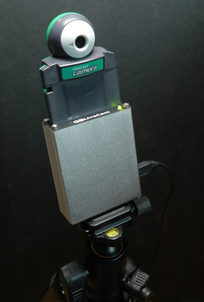
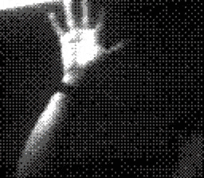

# GBLiveCam

GBLiveCam is an adapter which turns a Game Boy Camera (or Pocket Camera) cartridge into an USB webcam.
No screwdrivers and destruction required: just plug and stream !

Video resolution is 256 * 224 pixels (original 128 * 112 picture scaled x2) to cancel out the chroma sub-sampling of the NV12 (YUV420) format. Frame rate is fixed 8 fps. No audio.

# How to build

* Order at least the main PCB: `GBLiveCam_B - CADCAM.ZIP` (60 * 75mm, 2 layers, thickness 1.6mm).
* Only order the top and bottom panel PCBs (64 * 23mm, 2 layers, thickness 1mm) if you want the aluminum enclosure.
  * Order a 64 * 23.5 * 75mm aluminum enclosure, and 8 M2*10mm hex head screws.
* Solder all components, solder the GB cart slot and the USB connector last. The bicolor LED must be bent 90°. The USB connector must be 2mm away from the edge of the PCB.
* Check the tantalum caps polarity, otherwise they'll politely let you know they were backwards by exploding.
* Bridge the B0 pads with solder.
* Connect to computer via USB, if nothing smokes or catches on fire, an "STM32 BOOTLOADER" USB device should be detected.
* Flash the firmware `Firmware\Release\GBLiveCam.bin` with dfu-util: `dfu-util --device 0483:df11 -a 0 -s 0x08000000:leave --download GBLiveCam.bin`. The LED should light up red.
* Disconnected USB, clear the B0 pads so they aren't shorted anymore.
* Slide the main PCB in one of the aluminum enclosure's rails to see where the USB connector hole should be made. Remove the PCB and drill a 10~14mm hole, or mill a rectangular one.
* Place and screw a plate PCB on one end of the enclosure, slide the main PCB in (the right way around), place and screw the other end's plate.

# Firmware

If using PCB revision B, change the `#define PCBREV 'C'` line in main.h to `#define PCBREV 'B'`.

# How to use

* Stick a `Game Boy Camera` or `Pocket Camera` cartridge in the cart slot.
* Connect to computer via USB.
* You should see a `GBLiveCam` device appear.
* Use as a regular webcam !

Notes:
* The LED indicates the video stream status (red: only powered, green: streaming).
* The gain setting should be left between 2 and 5 most of the time. Play with brightness and contrast until you see something. The more light the better !
* The hue setting is used to select one of the eight available palettes. After a change, the palette name is displayed during ~2 seconds.
* The `sharpness` setting is used to trigger special functions according to the set value:
  * A value of `123` will show the firmware's version and the serial number.
  * A value of `999` will show debug values.
  * A value of `1337` will show "DFU!", indicating that stopping the video stream now will put the GBLiveCam into DFU (USB firmware update) mode, as if you had bridged the B0 pads again.
